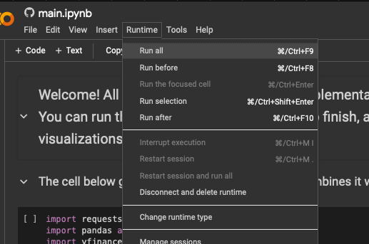

# Project: Optimal Portfolio Generator

## Run the Code in Google Colab

If you prefer running the code without downloading the repository or if you're a non-technical user, you can run the project directly in Google Colab. Click the badge below to open the notebook in your browser:

Simply navigate to the top bar, and under Runtime, click on "Run All" (see below):

Note: Initial downloads may be required when running in Colab.

## 0.5. Installation Instructions:
- Python version, packages, etc.
- Jupyter Notebook

## 1. Introduction:
The project is a notebook application that generates an optimal investment portfolio based on a user's risk tolerance and desired return profile. The portfolio optimizer utilizes historical price data of various assets such as bonds, stocks, and cryptocurrencies to construct an efficient frontier and recommend a portfolio allocation that maximizes returns for a given level of risk.

## 2. Project Structure:
The application workflow is structured as follows:

### 2.1 Data Gathering:
Historical price data is collected from various sources using APIs. Yahoo Finance is used for stock and bond data, considering a timeframe of at least three years due to API limitations. Additional data sources, such as the Federal Reserve sites, will be explored for supplementary economic indicators.

**Assets to be included:**
- **Bonds:**
  - Vanguard Aggregated Bond ETF (AGG)
  - Vanguard International Bond ETF (BNDX)
- **Stocks:**
  - S&P 500 (SPX)
  - S&P 500 Growth
  - S&P 500 Value
- **Cryptocurrencies:**
  - Bitcoin (BTC)
  - Ethereum (ETH)

### 2.2 Optimization Algorithm:
- User's risk tolerance and desired return profile collected as input.
- Historical risk-return profiles of each asset are analyzed.
- An optimization algorithm, similar to Excel's Solver but implemented in Python using `scipy.optimize`, is employed to generate optimal portfolio weights.
- Pre-calculated scenarios based on user risk preferences are considered to facilitate quick portfolio allocation.

### 2.3 Portfolio Construction:
- A DataFrame is created to capture volatility, returns, and weights of each asset combination.
- The optimization algorithm generates multiple portfolios ranging from conservative to aggressive based on risk-return preferences.
- Volatility constraints are enforced to ensure the generated portfolios align with the user's risk tolerance.

### 2.4 User Interface:
- A user-friendly interface is developed to input risk preferences and display recommended portfolios.
- Selected portfolio compositions are presented to the user along with their corresponding risk-return profiles.

### 2.5 Monte Carlo Simulation:
- After selecting a portfolio, a Monte Carlo simulation is conducted to forecast the investment's performance over a specified time horizon.
- The simulation provides a range of expected returns with a 95% confidence interval, offering insights into potential investment outcomes.

## 3. Project Pipeline Overview:
- Documentation outlining project methodology, including data sources and optimization techniques.
- Interactive application for portfolio optimization and selection.
- Monte Carlo simulation results for selected portfolios.

## 4. Conclusion:
The project aims to empower users to make informed investment decisions by providing personalized portfolio recommendations based on their risk preferences. By leveraging historical data and advanced optimization techniques, the application enables users to construct optimal portfolios tailored to their individual financial goals and risk tolerance levels.
